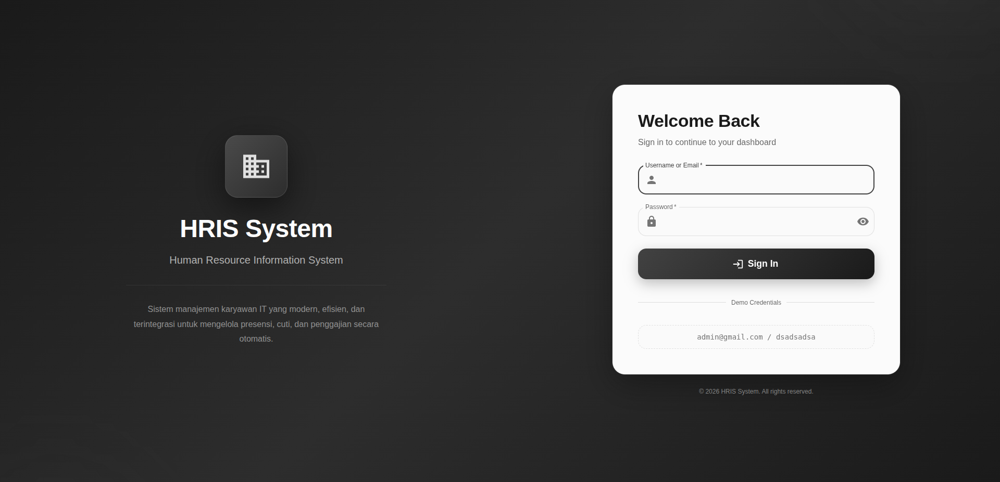
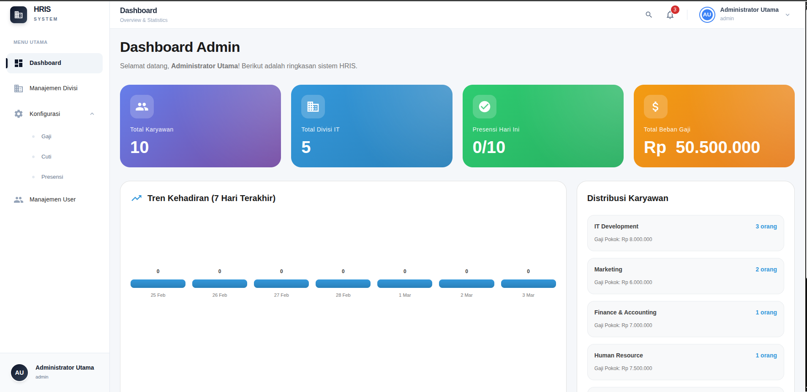
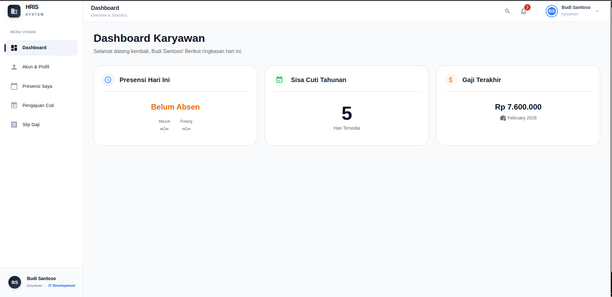
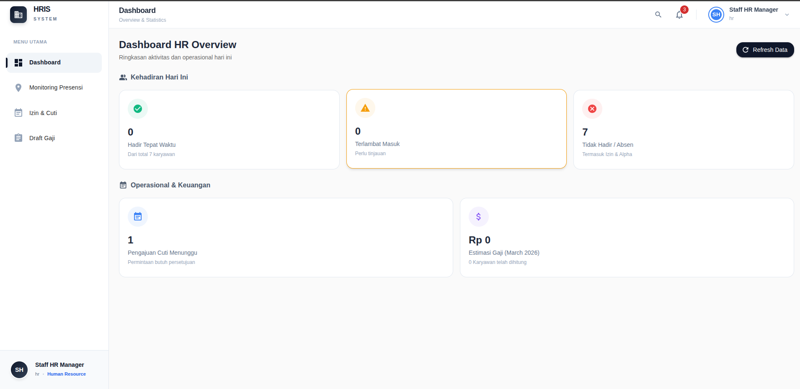
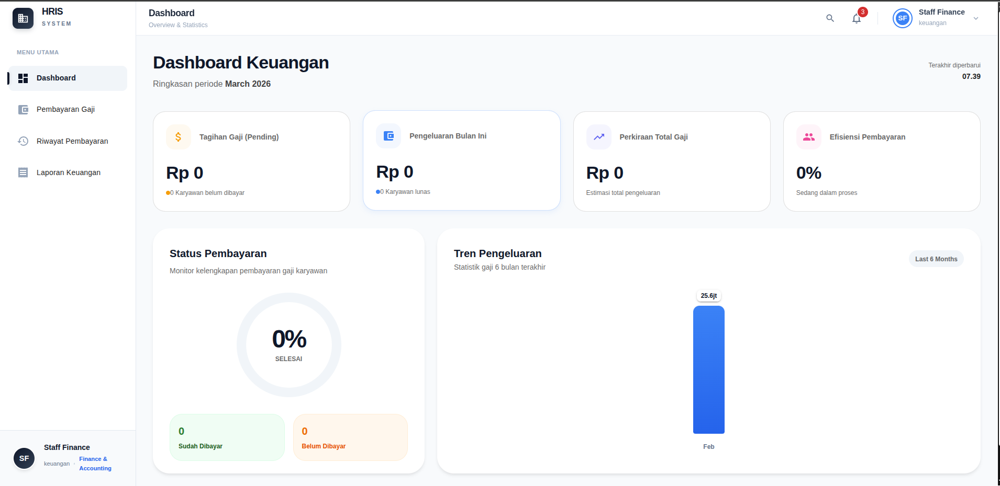

# HRIS System - IT Employee Management System


## Description

**Sistem Manajemen Sumber Daya Manusia Terpadu Berbasis Microservices**

Dirancang khusus untuk perusahaan teknologi modern, sistem ini menghadirkan efisiensi pengelolaan karyawan melalui arsitektur microservices yang handal, pemisahan proses bisnis yang jelas, dan pengalaman pengguna yang intuitif. Sistem ini mencakup panel terpisah untuk Admin, HR, Keuangan, dan Karyawan, memastikan alur kerja dan privasi data yang optimal.

## Features

- **Multi-Panel System:**
  - **Panel Admin:** Dashboard ringkasan data, manajemen user, konfigurasi presensi (radius & lokasi GPS), departemen, dan jabatan.
  - **Panel HR:** Kelola persetujuan cuti/izin karyawan dan manajemen draf gaji rutin.
  - **Panel Keuangan:** Eksekusi pembayaran gaji, kelola riwayat pembayaran bulanan, dan cetak slip pembayaran / laporan.
  - **Panel Karyawan:** Absensi realtime berbasis GPS (Geofencing), pengajuan cuti, pembaruan profil & rekening, serta akses slip gaji digital.
- **Microservices Architecture:** Memisahkan beban kerja Express.js untuk Panel Admin & Manajemen Config, serta Golang untuk API HR, Keuangan, dan Operasional Karyawan.
- **Geofencing Attendance:** Karyawan wajib _clock in/out_ di dalam zona radius yang ditentukan perusahaan secara _real-time_.
- **Automated Payroll & Deductions:** Kalkulasi gaji bersih otomatis berdasarkan kehadiran, keterlambatan, dan potongan-potongan bulanan.

## Tech Stack

- **Frontend:** React, Material UI (MUI v7), Vite, Typescript
- **Admin Service (Backend):** Express.js, Node.js, TypeScript
- **Core Service (Backend):** Golang (Gin Framework)
- **Database:** MySQL
- **Tooling:** Docker (Opsional), PNPM/NPM

## Installation

### Persyaratan Sistem

- Node.js (v18+)
- Golang (v1.20+)
- MySQL Server

### Langkah-langkah Installasi

1. **Clone repositori ini:**

   ```bash
   git clone https://github.com/azaryageraldo/HRIS-SYSTEM.git
   cd HRIS-SYSTEM
   ```

2. **Setup Database:**
   - Buat database MySQL dengan nama `db_hris` (atau sesuai nama di konfigurasi `.env`).
   - Eksekusi skrip SQL / Migration yang ada untuk membentuk tabel.

3. **Install Dependencies & Jalankan Backend Express.js (Panel Admin):**

   ```bash
   cd api-express
   npm install
   npm run dev
   ```

4. **Install Dependencies & Jalankan Backend Golang (Panel Layanan Inti):**

   ```bash
   cd api-golang
   go mod tidy
   go run cmd/main.go
   ```

5. **Install Dependencies & Jalankan Frontend (React):**
   ```bash
   cd frontend
   npm install
   npm run dev
   ```

## Environment Variables

Anda perlu membuat file `.env` di masing-masing direktori backend (`api-express` & `api-golang`) dan frontend.

**Contoh `.env` untuk `api-express`:**

```env
PORT=5000
DB_HOST=localhost
DB_USER=root
DB_PASSWORD=
DB_NAME=db_hris
DB_PORT=3306
JWT_SECRET=rahasia_admin_hris_anda
```

**Contoh `.env` untuk `api-golang`:**

```env
PORT=8080
DB_HOST=localhost
DB_USER=root
DB_PASSWORD=
DB_NAME=db_hris
DB_PORT=3306
JWT_SECRET=rahasia_admin_hris_anda
CORS_ORIGIN=http://localhost:3000
```

## API Documentation

Beberapa endpoint utama dalam sistem HRIS ini:

### Express.js (Port 5000) - Admin API

- `POST /api/auth/login`: Autentikasi Admin.
- `GET /api/users`: Mendapatkan daftar seluruh karyawan.
- `POST /api/attendance/config`: Setel konfigurasi jarak radius presensi.

### Golang (Port 8080) - Pegawai, HR, Keuangan API

- `GET /api/employee/dashboard`: Melihat statistik dashboard karyawan.
- `POST /api/employee/attendance/clock-in`: Melakukan presensi masuk (memerlukan payload Latitude/Longitude).
- `POST /api/employee/leave/request`: Ajukan cuti/izin karyawan.
- `GET /api/hr/leave`: Daftar ajuan izin cuti (Panel HR).
- `POST /api/finance/pay`: Eksekusi pembayaran slip gaji ke rekening (Panel Keuangan).

_(Untuk daftar lengkap definisi API, silakan periksa implementasi handler pada direktori source code masing-masing backend.)_

## Preview / Screenshot

Berikut adalah cuplikan layar dari berbagai fungsionalitas di HRIS System:

### 1. Halaman Login



### 2. Panel Admin



### 3. Panel Karyawan



### 4. Panel HR (Human Resource)



### 5. Panel Keuangan



## Author

**Azarya Geraldo**

- GitHub: [@azaryageraldo](https://github.com/azaryageraldo)

## License

Proyek ini menggunakan lisensi [MIT](https://opensource.org/licenses/MIT). Anda bebas untuk menggunakan, menyalin, memodifikasi, dan mendistribusikan proyek ini asalkan Anda mencantumkan pemberitahuan lisensi beserta hak cipta asli.
